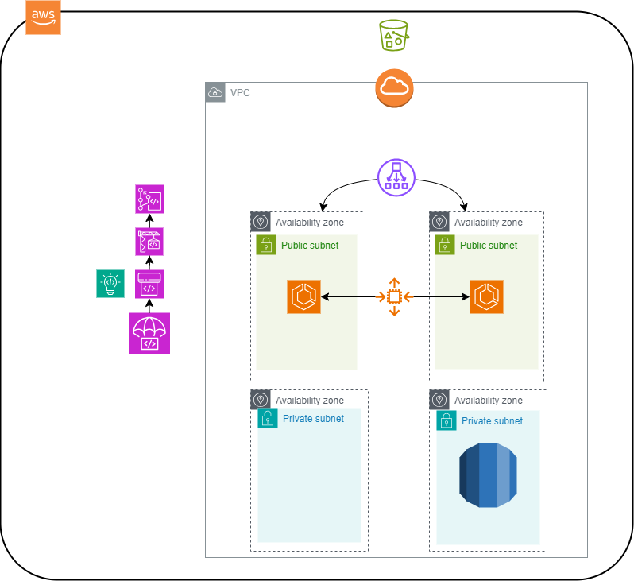

# Creating a CodePipeline infrastructure for Vikunja web app using ECS and S3
  

## Link:
http://vikunja-emumba-project.s3-website-us-east-1.amazonaws.com/

## Steps:
1. Created VPC of two subnets, internet gateway, one route table and security group. I attached the two subnets to the VPC - As Load balancer can't be connected to private subnets by default.

2. I created security group that allows inbound traffic to port 80, 3456 (vikunja's port), and 443.

3. created and S3 bucket for the frontend, and enabled s3 static sites with getObject bucket policy for public access. Then created an ECR repository, CodeCommit repo, and CodeGuru reviewer and attached it to the codecommit. 

4. I created Codebuild distribution with the policies required and prepared the buildspec.yml file that has the purpose of pulling the docker image of the vikunja's api, tag it and push it to the ECR repository.

5. For the Load Balancer, I tried to run Application load balancer but it didnt work beause ALB only supports port 80 and port 443 listening and forwarding, while the docker image's port is 3456 which requires something like network load balancer, which worked.

6. I created an ECS fargate cluster, with task definition of the container and service that is configured with blue green and network load balancer and autoscaling of min 1 and max 2 tasks. The service creation was done using the console due to facing issues in cloudformation with the service code.

7. For the CodeDeploy and CodePipeline, I pushed the frontend with static files to the codecommit repo, then created a pipeline that would git trigger by the codecommit events and push the files to the s3 static site enabled bucket.

8. I created CodeDeploy distribution that uses appspec to deploy the ecr's container to the ecs service, while using a second pipeline, I combined the codedeploy and codebuild's steps together.

9. The two of the subnets are set to public, as - according to my knowledge and search - the load balancer does not connect with private subnets from a face-internet ELB - by default.
